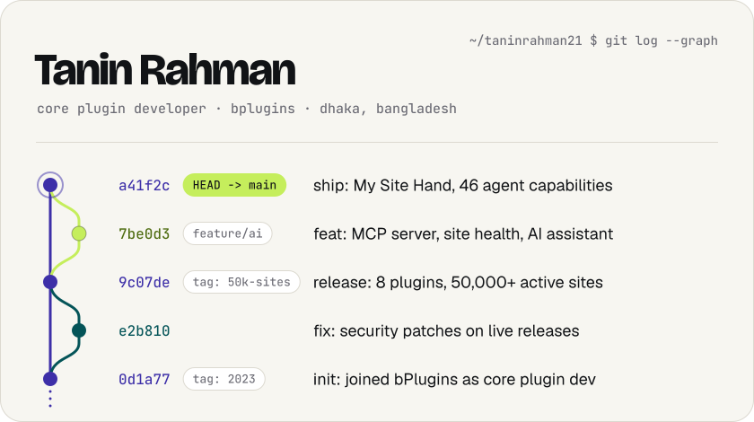
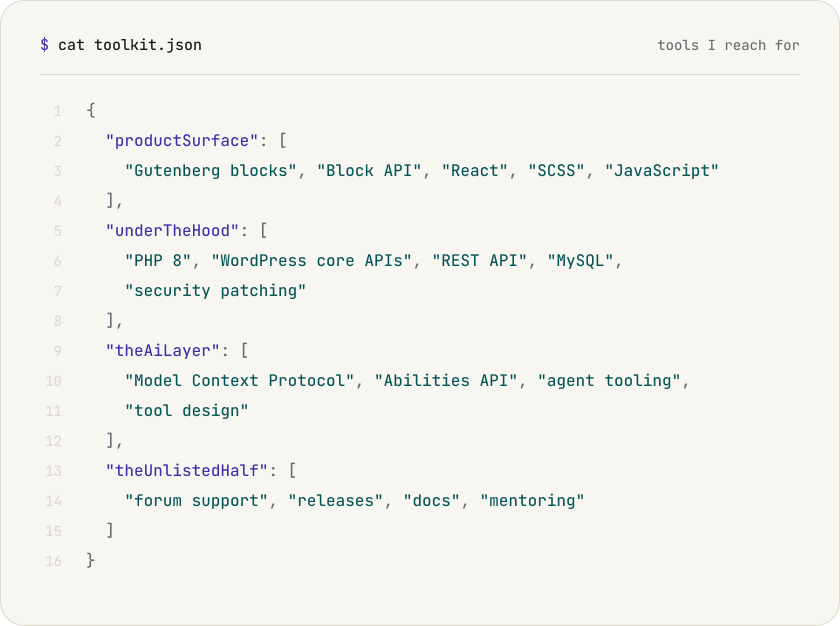
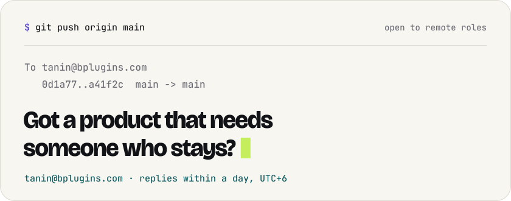

<picture>
  <source media="(prefers-color-scheme: dark)" srcset="./assets/banner-dark.svg">
  
</picture>

Hand me a spec and I'll take it all the way: block architecture, PHP backend, admin UI, security patches, releases, and the support thread that follows. I'm the core developer on eight production WordPress plugins at [bPlugins](https://bplugins.com), and lately I build tools that let AI agents work on real WordPress sites.

<a href="https://github.com/taninrahman21/my-site-hand">
<picture>
  <source media="(prefers-color-scheme: dark)" srcset="./assets/my-site-hand-dark.svg">
  
</picture>
</a>

> Nobody assigned me this one. I picked the spec up, learned MCP, shipped it to WordPress.org and put my own name on the profile.

[Source](https://github.com/taninrahman21/my-site-hand) · [WordPress.org](https://wordpress.org/plugins/my-site-hand/)

 

<a href="https://profiles.wordpress.org/taninrahman/">
<picture>
  <source media="(prefers-color-scheme: dark)" srcset="./assets/plugins-dark.svg">
  
</picture>
</a>

Open each plugin on WordPress.org

 

| Plugin | What it does |
| :--- | :--- |
| [PDF Poster](https://wordpress.org/plugins/pdf-poster/) | Embed and display PDFs with a Gutenberg block |
| [Advance Custom HTML](https://wordpress.org/plugins/advance-custom-html/) | Write HTML, CSS and JS with a live preview |
| [Document Embedder](https://wordpress.org/plugins/document-emberdder/) | Embed Office docs and PDFs in any post |
| [Timeline Block](https://wordpress.org/plugins/timeline-block-block/) | Horizontal and vertical timelines as a block |
| [Document Viewer](https://wordpress.org/plugins/embed-office-viewer/) | View Office files right on the page |
| [B Timeline](https://wordpress.org/plugins/b-timeline/) | Styled timelines for any story |
| [StreamCast](https://wordpress.org/plugins/streamcast/) | Live radio streaming with a player block |
| [Voice Feedback](https://wordpress.org/plugins/voice-feedback/) | Let visitors leave voice messages |

The plugins are owned by bPlugins. I build, ship and support them.

 

<picture>
  <source media="(prefers-color-scheme: dark)" srcset="./assets/toolkit-dark.svg">
  
</picture>

 

<a href="mailto:builtbytanin@gmail.com">
<picture>
  <source media="(prefers-color-scheme: dark)" srcset="./assets/contact-dark.svg">
  
</picture>
</a>
