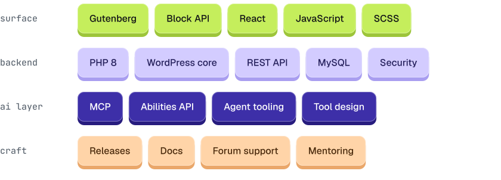
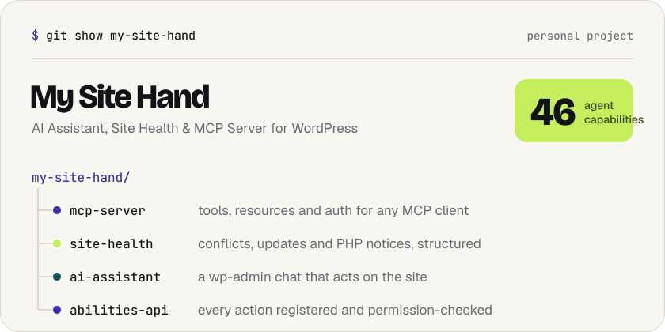
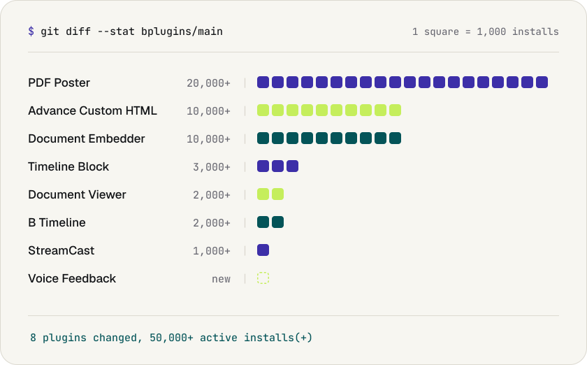

<picture>
  <source media="(prefers-color-scheme: dark)" srcset="./assets/typing-dark.svg">
  
</picture>

 

I'm the core developer on eight production WordPress plugins at [bPlugins](https://bplugins.com), running on **50,000+ active sites**. I own the whole lifecycle: block architecture, PHP backend, admin UI, releases, and the support thread that follows. Lately I build tools that let AI agents work on real WordPress sites.

## Skills

<picture>
  <source media="(prefers-color-scheme: dark)" srcset="./assets/skills-dark.svg">
  
</picture>

## My own plugin: My Site Hand

An AI Assistant, Site Health and MCP Server for WordPress. It lets AI agents read, diagnose and act on a real site.

<picture>
  <source media="(prefers-color-scheme: dark)" srcset="./assets/my-site-hand-dark.svg">
  
</picture>

 

&nbsp;

## Plugins I ship at bPlugins

<a href="https://profiles.wordpress.org/taninrahman/">
<picture>
  <source media="(prefers-color-scheme: dark)" srcset="./assets/plugins-dark.svg">
  
</picture>
</a>

Owned by bPlugins. Built, shipped and supported by me. Click the bar to see them all on WordPress.org.

## Let's talk

Building something with WordPress or AI agents? Press the key and I'll reply within a day.

